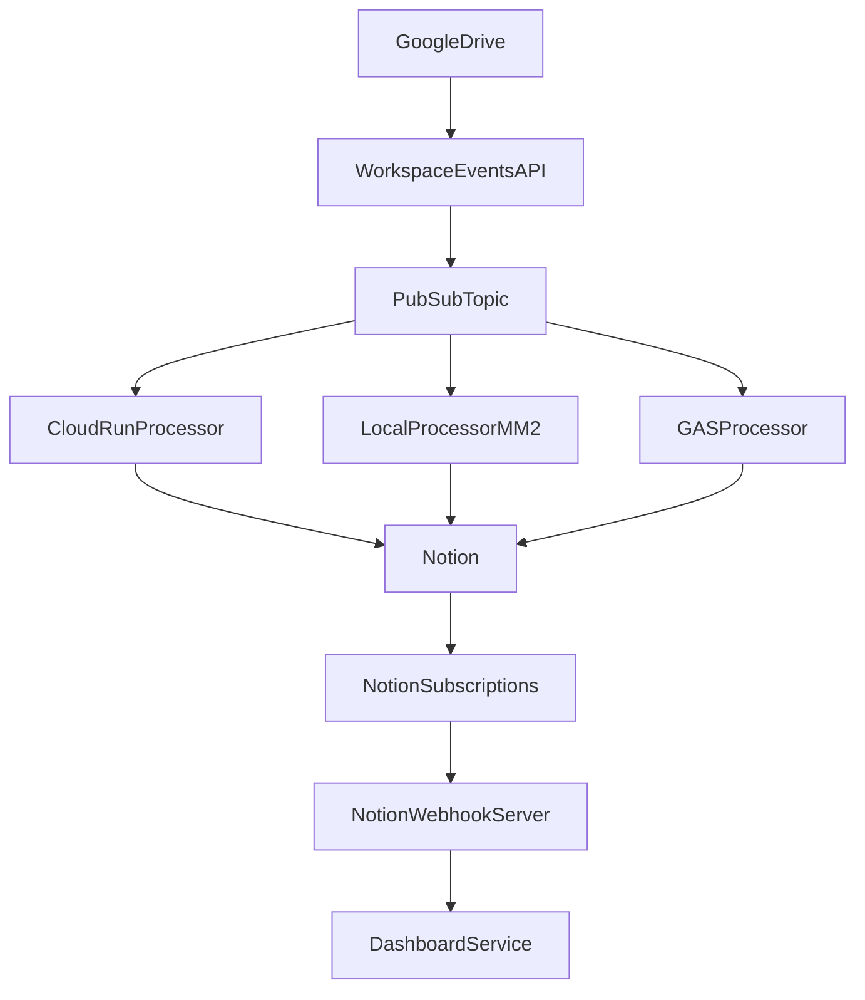

# Workspace Events + Notion Webhooks: Multi-Node Architecture

## Overview

This repository implements **two webhook/event ingestion sources**:

- **Google Workspace Events API** (Drive → Pub/Sub → processors)
- **Notion Event Subscriptions** (Notion → webhook server)

They are designed to run concurrently **without circular feedback loops** by using:

- **Loop-guard tagging on Notion writes** (property-based origin markers)
- **Drive artifact ignore rules** (name-prefix ignores for automation-generated CSV/log files)
- **Short-term dedupe** on the Notion webhook receiver to prevent rapid reprocessing

## Nodes

### Cloud node (GitHub Actions + Cloud Run)

- **Deploy workflow**: `.github/workflows/workspace-events-cloud.yml`
- **Cloud Run service**: `seren-media-workflows/scripts/workspace_events/cloud_run_main.py`
  - Receives Pub/Sub push at `POST /pubsub/push`
  - Processes events using `core/event_handler.py`
- **Poll safety-net**: `seren-media-workflows/scripts/workspace_events/cloud_run_poll.py`
  - Pulls from Pub/Sub on a schedule and processes synchronously
  - Optionally uploads CSV logs to Drive via `core/csv_exporter.py`

### Local node (MM2 / Mac Mini M1 Pro)

- **Webhook server**: `webhook-server/notion_event_subscription_webhook_server_v5_multi_node.py`
  - Imports and runs the mature v4 implementation
  - Starts the Workspace Events Pub/Sub pull consumer (`webhook-server/workspace_events_integration.py`)
  - Exposes Workspace Events status endpoints:
    - `GET /workspace-events/status`
    - `GET /workspace-events/health`
- **Dashboard service (v2)**: `webhook-server/webhook_dashboard_service_v2.py`
  - Adds multi-node status + CSV visibility endpoints

Start both locally with:

- `webhook-server/start_multi_node_server.sh`

### Google Apps Script node (complementary)

- **GAS project**: `gas-scripts/workspace-events-sync/`
  - Pulls Pub/Sub messages via REST
  - Parses CloudEvents
  - Upserts Drive metadata into Notion
  - Writes event CSV logs to a Drive folder
  - Adds loop-guard properties on Notion writes

## Data Flow

## Loop-Guard Safeguards (Critical)

### 1) Notion write tagging (“origin markers”)

All automation writes to Notion should set these properties (created if missing):

- **`Seren Automation Source`**
- **`Seren Automation Event ID`**
- **`Seren Automation Node`**

Implemented in:

- `seren-media-workflows/scripts/workspace_events/drive_sync_handler.py`
- `gas-scripts/workspace-events-sync/NotionSync.js`

### 2) Notion webhook ignore rules

The Notion webhook server ignores webhook events when:

- `Seren Automation Source` is one of:
  - `workspace_events`
  - `gas_workspace_events`
  - `drivesheetsync`
  - `notion_webhook_server`
- Or the event is detected as a rapid duplicate (short-term cache)

Implemented in:

- `webhook-server/notion_event_subscription_webhook_server_v4_enhanced.py`

### 3) Drive artifact ignore rules

Drive→Notion sync ignores automation-generated CSV/log files by name prefix:

- `webhook_events_`
- `workspace_events_`
- `notion_database_webhooks_` (Notion webhook server CSV logs)

Implemented in:

- `seren-media-workflows/scripts/workspace_events/drive_sync_handler.py`
- `gas-scripts/workspace-events-sync/Config.js` + `DriveHandler.js`

## Slack Event Subscriptions alignment

Slack Event Subscriptions are treated as a first-class “event subscription source” alongside Notion and Workspace Events:

- Endpoint: `POST /slack/events` in `webhook-server/notion_event_subscription_webhook_server_v4_enhanced.py`
- Processing: payload is validated and then queued via `WebhookQueue` (sequential, resource-controlled)
- Observability:
  - CSV logs to `SLACK_EVENTS_CSV_DIR` (`slack_event_subscriptions_{YYYY-MM-DD}.csv`)
  - Optional dashboard ingest (`WEBHOOK_DASHBOARD_INGEST_URL`, requires `WEBHOOK_DASHBOARD_API_KEY`)

Safeguards:

- **Deduplication** by `event_id` (TTL cache)
- **Bot message suppression** by default

## CSV Outputs

- **Workspace Events processed-event logs**:
  - Python: `seren-media-workflows/scripts/workspace_events/core/csv_exporter.py`
  - GAS: `gas-scripts/workspace-events-sync/CSVExporter.js`
- **Notion webhook payload logs**:
  - `webhook-server/notion_event_subscription_webhook_server_v4_enhanced.py` (daily CSV in `WEBHOOK_CSV_DIR`)

